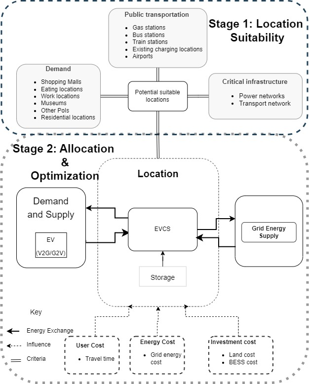

# A GIS-MILP Framework for Electric Vehicle Charging Station Placement and Optimization: A Case Study in Eindhoven, the Netherlands

This repository contains selected data, scripts, and results associated with the journal paper:

**“A GIS-MILP framework for electric vehicle charging station placement and optimization: A Case Study in Eindhoven, Netherlands”**, published in *Computers, Environment and Urban Systems*.

The project develops an integrated **Geographic Information System and Mixed-Integer Linear Programming framework** for planning electric vehicle charging stations. The framework combines spatial suitability analysis with optimization of charging station placement, travel time, investment cost, grid energy use, battery storage, and Vehicle-to-Grid flows.

The case study focuses on Eindhoven, the Netherlands.

---

## Summary

1. [Workflow and Datasets](#workflow-and-datasets)  
2. [Requirements](#1-requirements)
3. [Datasets](#2-Datasets) 
4. [Setup](#3-setup-gis--milp)  
5. [Repository Files](#4-repository-files)  
6. [Outputs]#(5-outputs)  
7. [Writing and Citation](#6-writing-and-citation)  
8. [Acknowledgement](#7-acknowledgement)  
8. [Further Reading](#8-further-reading)

---

## Workflow and Datasets

The workflow combines two main stages:

1. **GIS-based spatial suitability analysis**  
   Spatial data are processed to evaluate candidate locations for electric vehicle charging stations. The spatial analysis considers accessibility, proximity to demand, road network conditions, grid infrastructure, land-use context, and other relevant spatial variables.

2. **MILP-based optimization**  
   Candidate locations and spatial outputs from the GIS stage are used as inputs to a Mixed-Integer Linear Programming model. The optimization model selects charging station locations and operational decisions while considering cost, travel time, grid energy use, storage capacity, and V2G energy flows.

Data were obtained from open-access Dutch and international sources, including CBS, OpenStreetMap, public infrastructure datasets, and other spatial data providers. Some raw datasets may need to be downloaded directly from the original providers because of licensing or file-size limitations.

The repository includes selected processed inputs, optimization scripts, and output files used for analysis and visualization.



---

## 1. Requirements

The workflow was developed using the following software:

- [ArcGIS Pro](https://www.arcgis.com/index.html) `[Licensed]`
- [Gurobi Optimizer](https://www.gurobi.com/) `[Licensed academic/commercial]`
- [Python](https://www.python.org/) `[Free]`
- [R](https://www.r-project.org/) `[Free]`
- [QGIS](https://www.qgis.org/) `[Free, optional]`
- [LaTeX](https://www.latex-project.org/) `[Free]`
- [Microsoft Excel](https://www.microsoft.com/en-us/microsoft-365/excel) `[Licensed]`

## 2. Datesets
The datasets in this folder include GIS and MILP files. Due to the size of the GIS files which include Road network, Neighbourhood and Points of interesting are not included but can be public accessed through [CBS](https://www.cbs.nl/), [PDOK](https://app.pdok.nl/viewer/#x=160000.00&y=455000.00&z=3.0000&background=BRT-A%20standaard&layers=) and [Esri living atlas of the world](https://livingatlas.arcgis.com/en/home/)'[Licensed]'.

Furthermore, in the data is included the result files of the TT run and MC run. These folders contain all the outputs from the model of the GIS suitability analysis and the MILP outputs. The specific folder names are [MC_run](https://github.com/mkvusa/GIS_MILP_Optimisation-FlexEC/tree/main/MC_run_results) and [TT_run](https://github.com/mkvusa/GIS_MILP_Optimisation-FlexEC/tree/main/TT_results). Each folder has files pattening to the model output with initial labeling starting with TT or MC to differentiate the individual planning objective prioritization scenario setup.

Furthermore in the folder [Scripts](mkvusa/GIS_MILP_Optimisation-FlexEC/Scripts/MC_results_analysis.ipynb) the used scripts are presented. The main files in this folder is the script for the MILP which is label [TT_run](mkvusa/GIS_MILP_Optimisation-FlexEC/Scripts/TT_run_EVCS.ipynb) for the travel time optimzation scenario setup and the [MC_run](mkvusa/GIS_MILP_Optimisation-FlexEC/Scripts/MC_run_EVCS.ipynb) for the monetary cost scenario setup. For further datails of this read the published article.

Main Python packages include:

```python
pandas
numpy
geopandas
shapely
networkx
osmnx
gurobipy
matplotlib
seaborn
openpyxl
